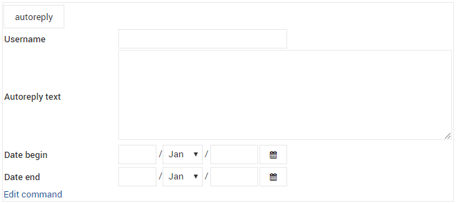

Settings of the custom autoreply

1. Создаем файл с текстом автоответа для конкретного пользователя < user name> в папке  /etc/postfix/autoreply_msg/:
# mcedit /etc/postfix/autoreply_msg/<name user>.msg
Добрый день. С 01.01.2016 по 15.01.2016 я буду на больничном, по всем вопросам обращаться по телефону 3432142345435. Спасибо.

3. Создаем файл autoreply_< user name>.pl, который будет выполнять отправку автоответа
# mcedit /etc/postfix/scripts/autoreply_<name user>.pl
#!/usr/bin/perl

use strict;
use MIME::Base64;

my ($to, $from) = @ARGV;
$from =~ s/autoreply.2100.gosniias.ru/2100.gosniias.ru/;

open MAIL, "| /usr/sbin/sendmail -t -oi";
print MAIL "To: $to\nFrom: <name user>\@2100.gosniias.ru\nSubject: Notify\n";
print MAIL 'MIME-Version: 1.0', "\n";
print MAIL 'Content-Type: text/plain; charset="utf-8"', "\n";
print MAIL 'Content-Transfer-Encoding: base64', "\n\n";
# get text from file
open MSG, "/etc/postfix/autoreply_msg/<name user>.msg";
my $msg = "autoreply from $from\n\n" . join ( "", <MSG> );
print MAIL encode_base64($msg), "\n";
close MSG;

close MAIL;
# chown autoreply:autoreply /etc/postfix/scripts/autoreply_<name user>.pl
# chmod +x /etc/postfix/scripts/autoreply_<name user>.pl
4. Вносим изменения в кофигурационных файлах postfix
В /etc/postfix/master.cf добавляем следующее:
[...]
autoreply_<user name>
        unix    -       n       n       -       -       pipe
        flags=R user=autoreply argv=/etc/postfix/scripts/autoreply_<user name>.pl ${sender} ${recipient}
В /etc/postfix/transport  добавляем строчку вида:
<user name>.autoreply.2100.gosniias.ru autoreply_<user name>:
# здесь мы определяем транспорт для несуществующего домена.autoreply.domain.ru. Домен этот нужен для того что бы однозначно определить юзера в определенном домене.
В /etc/postfix/virtual добавляем строчку вида. Вместо aafokin необходимый user_name:
 afokin@2100.gosniias.ru aafokin@2100.gosniias.ru  aafokin@aafokin.autoreply.2100.gosniias.ru
# здесь мы указыаем что пришедшую почту на  ivanov@domain.ru надо доставить ему же и на ящик autoreply@ivanov.autoreply.domain.ru(домен которого будет обслуживаться по правилам указанным в master.cf согласно транспорту указанному в transport)
После внесения соответствующих изменений требуется сформировать данный виртуальный почтовый ящик и транспорт:
# postmap /etc/postfix/transport
# postmap /etc/postfix/virtual

После чего перезагружаем постфикс и тестируем автоответ:
# systemctl reload postfix
